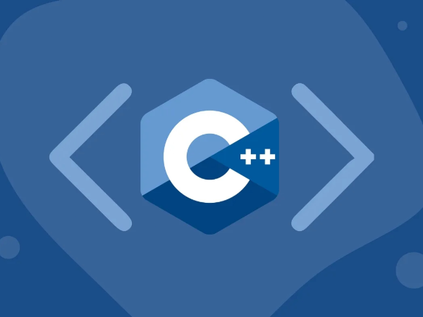

# 42cpp-modules

## 35 C++ exercises from beginner to advanced



A series of exercises designed to master the **C++** programming language and its advanced features. The modules transition from procedural programming in **C** to **object-oriented** programming ```OOP``` in **C++**, focusing on modern coding practices and essential language concepts.

I completed these modules during my studies at **Hive Helsinki**, where I gained valuable knowledge and skills in C++ programming.
I worked on these modules throughout **2023** and **2024**, but I wanted to redo the commit history and make some minor changes.

## 📖 Topics
  - Object-oriented programming
  - Advanced polymorphism
  - C++ STL
  - Exceptions
  - C++ templates
  - Advanced casting
  - I/O manipulation

## 🛠️ Langs/Tools
  - C++
  - Makefile

## 🦉 Getting started

  1. ```git clone https://github.com/kenlies/42cpp-modules```
  2. ```cd 42cpp-modules/mod<number>/ex<number>```
  3. ```make```
  4. ```./<executable_name>```

## 🔨 To improve

The documentation for these modules is, regrettably, quite sparse. I've attempted to outline the topics of each module below. ```module09```, in particular, includes a few larger projects, one of which involves implementing the **Merge-Insertion Sort Algorithm**.

## 📄 Content

```
├── module00 ─── [Encapsulation, initialization and namespaces]
│     ├── ex00
│     ├── ex01
│     └── ex02
├── module01 ─── [Memory allocation & pointers/references]
│     ├── ex00
│     ├── ex01
│     ├── ex02
│     ├── ex03
│     ├── ex04
│     ├── ex05
│     └── ex06
├── module02 ─── [Ad-hoc polymorphism, operator overloading]
│     ├── ex00
│     ├── ex01
│     ├── ex02
│     └── ex03
├── module03 ─── [Inheritance]
│     ├── ex00
│     ├── ex01
│     ├── ex02
│     └── ex03
├── module04 ─── [Abstract classes, interfaces]
│     ├── ex00
│     ├── ex01
│     ├── ex02
│     └── ex03
├── module05 ─── [Exceptions]
│     ├── ex00
│     ├── ex01
│     ├── ex02
│     └── ex03
├── module06 ─── [Casting]
│     ├── ex00
│     ├── ex01
│     └── ex02
├── module07 ─── [Templates]
│     ├── ex00
│     ├── ex01
│     └── ex02
├── module08 ─── [Containers & iterators]
│     ├── ex00
│     ├── ex01
│     └── ex02
└── module09 ─── [Containers continued]
      ├── ex00
      ├── ex01
      └── ex02
```
